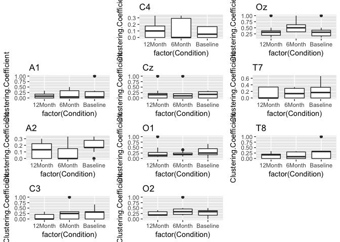
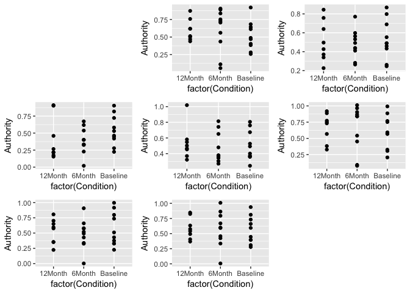
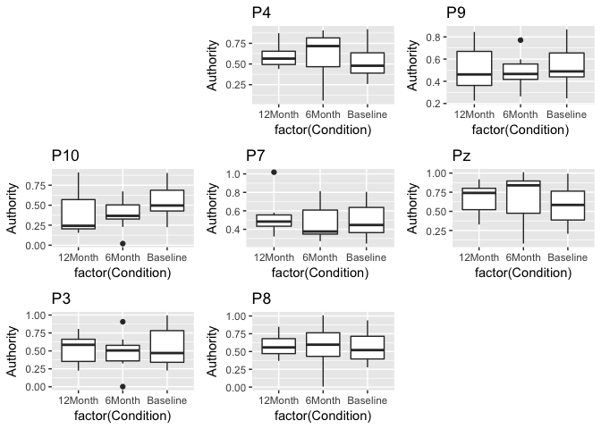

Statistical Analysis of Graph Theory Metrics
================
Amna
2018-03-19

Set up a Multiple plot function to plot all box plots, violin plots and scatterplots together

``` r
# Multiple plot function
#
# ggplot objects can be passed in ..., or to plotlist (as a list of ggplot objects)
# - cols:   Number of columns in layout
# - layout: A matrix specifying the layout. If present, 'cols' is ignored.
#
# If the layout is something like matrix(c(1,2,3,3), nrow=2, byrow=TRUE),
# then plot 1 will go in the upper left, 2 will go in the upper right, and
# 3 will go all the way across the bottom.
#
multiplot <- function(..., plotlist=NULL, file, cols=1, layout=NULL) {
  library(grid)

  # Make a list from the ... arguments and plotlist
  plots <- c(list(...), plotlist)

  numPlots = length(plots)

  # If layout is NULL, then use 'cols' to determine layout
  if (is.null(layout)) {
    # Make the panel
    # ncol: Number of columns of plots
    # nrow: Number of rows needed, calculated from # of cols
    layout <- matrix(seq(1, cols * ceiling(numPlots/cols)),
                    ncol = cols, nrow = ceiling(numPlots/cols))
  }

 if (numPlots==1) {
    print(plots[[1]])

  } else {
    # Set up the page
    grid.newpage()
    pushViewport(viewport(layout = grid.layout(nrow(layout), ncol(layout))))

    # Make each plot, in the correct location
    for (i in 1:numPlots) {
      # Get the i,j matrix positions of the regions that contain this subplot
      matchidx <- as.data.frame(which(layout == i, arr.ind = TRUE))

      print(plots[[i]], vp = viewport(layout.pos.row = matchidx$row,
                                      layout.pos.col = matchidx$col))
    }
  }
}
```

Setting up the Data
===================

``` r
setwd("/Users/amnahyder/Documents/Lab work/AllGraphTheory")
GlobalData<- read.table("ALL_Data.csv", sep = ",", header = TRUE, stringsAsFactors = FALSE)
library(dplyr)
```

    ## 
    ## Attaching package: 'dplyr'

    ## The following objects are masked from 'package:stats':
    ## 
    ##     filter, lag

    ## The following objects are masked from 'package:base':
    ## 
    ##     intersect, setdiff, setequal, union

``` r
library(ggplot2)
AllData<- read.table("ALL_Data_all.csv", sep = ",", header = TRUE, stringsAsFactors = FALSE)
str(AllData)
```

    ## 'data.frame':    756 obs. of  9 variables:
    ##  $ Subject               : chr  "04_6m" "01_6m" "05_6m" "08_6m" ...
    ##  $ Degree                : int  4 3 4 3 3 5 3 2 3 4 ...
    ##  $ Clustering.Coefficient: num  0 0 0.333 0 0.333 ...
    ##  $ Local.Reachability    : num  1 1 1 1 1 ...
    ##  $ Betweenness           : num  0.0498 0.0445 0.0839 0.0309 0.0769 ...
    ##  $ Hub.Value             : num  0.447 0.338 0.721 0.317 0.568 ...
    ##  $ Authority             : num  0.447 0.338 0.721 0.317 0.568 ...
    ##  $ Condition             : chr  "6Month" "6Month" "6Month" "6Month" ...
    ##  $ Electrode             : chr  "A1" "A1" "A1" "A1" ...

``` r
Frontal <- 'F'
AllDataF <- subset(AllData, grepl(Frontal, Electrode) )
Parietal <- 'P'
AllDataP <- subset(AllData, grepl(Parietal, Electrode) )

AllDataO <- subset(AllData, !grepl(Frontal, Electrode) )
AllDataO <- subset(AllDataO, !grepl(Parietal, Electrode) )
```

Global Graph Theory Metrics
===========================

Look at the global graph theory metrics for participants

``` r
str(GlobalData)
```

    ## 'data.frame':    28 obs. of  7 variables:
    ##  $ Subject          : chr  "04_6m" "01_6m" "05_6m" "08_6m" ...
    ##  $ Density          : num  0.154 0.14 0.137 0.14 0.108 ...
    ##  $ Global.Efficiency: num  0.481 0.457 0.439 0.47 0.375 ...
    ##  $ Modularity       : num  0.395 0.403 0.422 0.409 0.539 ...
    ##  $ Clustering.Coeff : num  0.195 0.181 0.278 0.084 0.232 ...
    ##  $ Condition        : chr  "6Month" "6Month" "6Month" "6Month" ...
    ##  $ Electrode        : chr  "Global" "Global" "Global" "Global" ...

``` r
#global.efficiency
ggplot(data=GlobalData) + 
  geom_boxplot( aes(x=factor(Condition), y=Global.Efficiency))  + ggtitle('Global.Efficiency')
```


``` r
ggplot(data=GlobalData) +
  geom_violin( aes(x=factor(Condition), y=Global.Efficiency))  + ggtitle('Global.Efficiency')
```


``` r
ggplot(GlobalData, aes(x=factor(Condition), y=Global.Efficiency)) +
  geom_point() + ggtitle('Global.Efficiency')
```


``` r
#Density
ggplot(data=GlobalData) + 
  geom_boxplot( aes(x=factor(Condition), y=Density))  + ggtitle('Density')
```


``` r
ggplot(data=GlobalData) +
  geom_violin( aes(x=factor(Condition), y=Density))  + ggtitle('Density')
```


``` r
ggplot(GlobalData, aes(x=factor(Condition), y=Density)) +
  geom_point() + ggtitle('Density')
```


``` r
#Modularity
ggplot(data=GlobalData) + 
  geom_boxplot( aes(x=factor(Condition), y=Modularity))  + ggtitle('Modularity')
```


``` r
ggplot(data=GlobalData) +
  geom_violin( aes(x=factor(Condition), y=Modularity))  + ggtitle('Modularity')
```


``` r
ggplot(GlobalData, aes(x=factor(Condition), y=Modularity)) +
  geom_point() + ggtitle('Modularity')
```


``` r
#Clustering.Coeff
ggplot(data=GlobalData) + 
  geom_boxplot( aes(x=factor(Condition), y=Clustering.Coeff))  + ggtitle('Clustering.Coeff')
```


``` r
ggplot(data=GlobalData) +
  geom_violin( aes(x=factor(Condition), y=Clustering.Coeff))  + ggtitle('Clustering.Coeff')
```


``` r
ggplot(GlobalData, aes(x=factor(Condition), y=Clustering.Coeff)) +
  geom_point() + ggtitle('Clustering.Coeff')
```


Local Graph theory Metrics
==========================

CLUSTERING COEFFICIENT
----------------------

First we look at the local clustering coefficients in all frontal electrodes

``` r
ggplot(data=AllDataF) + 
geom_boxplot( aes(x=factor(Electrode), y=Clustering.Coefficient, fill=factor(Condition)), position=position_dodge(1)) +ggtitle("Clustering Coefficient")+
    scale_x_discrete(breaks=c(1, 2, 3), labels=c("6Month", "12Month", "Baseline"))
```


``` r
ggplot(data=AllDataF) + 
geom_violin( aes(x=factor(Electrode), y=Clustering.Coefficient, fill=factor(Condition)), position=position_dodge(1)) +ggtitle("Clustering Coefficient")+
    scale_x_discrete(breaks=c(1, 2, 3), labels=c("6Month", "12Month", "Baseline"))
```


``` r
#plot all of the electrodes seperately
boxplots = list()
violinplots =list()
scatterplots = list()
for (elec in unique(AllDataF$Electrode)){
  print(elec)
  data_to_plot = data.frame(AllDataF[AllDataF["Electrode"] == elec,])
  PLOTS<-ggplot(data=data_to_plot) + 
  geom_boxplot( aes(x=factor(Condition), y=Clustering.Coefficient))  + ggtitle(elec)
  boxplots[[elec]] =PLOTS
  VPLOTS<-ggplot(data=data_to_plot) +
  geom_violin( aes(x=factor(Condition), y=Clustering.Coefficient))  + ggtitle(elec)
  violinplots[[elec]] =VPLOTS
  SPLOT<-ggplot(data_to_plot, aes(x=factor(Condition), y=Clustering.Coefficient)) +
  geom_point()
  scatterplots[[elec]]=SPLOT
}
```

    ## [1] "F10"
    ## [1] "F3"
    ## [1] "F4"
    ## [1] "F7"
    ## [1] "F8"
    ## [1] "F9"
    ## [1] "Fp1"
    ## [1] "Fp2"
    ## [1] "Fpz"
    ## [1] "Fz"

``` r
multiplot(plotlist=violinplots,cols=3,rows=2)
```


    ## [1] 2

``` r
multiplot(plotlist=scatterplots,cols=3,rows=2)
```


    ## [1] 2

``` r
multiplot(plotlist=boxplots,cols=3,rows=2)
```


    ## [1] 2

Clustering Coefficient for all Parietal electrodes

``` r
#plot all of the electrodes seperately
boxplots = list()
violinplots =list()
scatterplots = list()
for (elec in unique(AllDataP$Electrode)){
  print(elec)
  data_to_plot = data.frame(AllDataP[AllDataP["Electrode"] == elec,])
  PLOTS<-ggplot(data=data_to_plot) + 
  geom_boxplot( aes(x=factor(Condition), y=Clustering.Coefficient))  + ggtitle(elec)
  boxplots[[elec]] =PLOTS
  VPLOTS<-ggplot(data=data_to_plot) +
  geom_violin( aes(x=factor(Condition), y=Clustering.Coefficient))  + ggtitle(elec)
  violinplots[[elec]] =VPLOTS
  SPLOT<-ggplot(data_to_plot, aes(x=factor(Condition), y=Clustering.Coefficient)) +
  geom_point()
  scatterplots[[elec]]=SPLOT
}
```

    ## [1] "P10"
    ## [1] "P3"
    ## [1] "P4"
    ## [1] "P7"
    ## [1] "P8"
    ## [1] "P9"
    ## [1] "Pz"

``` r
multiplot(plotlist=violinplots,cols=3,rows=2)
```


    ## [1] 2

``` r
multiplot(plotlist=scatterplots,cols=3,rows=2)
```


    ## [1] 2

``` r
multiplot(plotlist=boxplots,cols=3,rows=2)
```


    ## [1] 2

Clustering Coefficient for all other electrodes

``` r
#plot all of the electrodes seperately
boxplots = list()
violinplots =list()
scatterplots = list()
for (elec in unique(AllDataO$Electrode)){
  print(elec)
  data_to_plot = data.frame(AllDataO[AllDataO["Electrode"] == elec,])
  PLOTS<-ggplot(data=data_to_plot) + 
  geom_boxplot( aes(x=factor(Condition), y=Clustering.Coefficient))  + ggtitle(elec)
  boxplots[[elec]] =PLOTS
  VPLOTS<-ggplot(data=data_to_plot) +
  geom_violin( aes(x=factor(Condition), y=Clustering.Coefficient))  + ggtitle(elec)
  violinplots[[elec]] =VPLOTS
  SPLOT<-ggplot(data_to_plot, aes(x=factor(Condition), y=Clustering.Coefficient)) +
  geom_point()
  scatterplots[[elec]]=SPLOT
}
```

    ## [1] "A1"
    ## [1] "A2"
    ## [1] "C3"
    ## [1] "C4"
    ## [1] "Cz"
    ## [1] "O1"
    ## [1] "O2"
    ## [1] "Oz"
    ## [1] "T7"
    ## [1] "T8"

``` r
multiplot(plotlist=violinplots,cols=3,rows=2)
```


    ## [1] 2

``` r
multiplot(plotlist=scatterplots,cols=3,rows=2)
```


    ## [1] 2

``` r
multiplot(plotlist=boxplots,cols=3,rows=2)
```



    ## [1] 2

DEGREE
------

We now look at the Degree in all frontal electrodes

``` r
ggplot(data=AllDataF) + 
geom_boxplot( aes(x=factor(Electrode), y=Degree, fill=factor(Condition)), position=position_dodge(1)) +ggtitle("Clustering Coefficient")+
    scale_x_discrete(breaks=c(1, 2, 3), labels=c("6Month", "12Month", "Baseline"))
```


``` r
ggplot(data=AllDataF) + 
geom_violin( aes(x=factor(Electrode), y=Degree, fill=factor(Condition)), position=position_dodge(1)) +ggtitle("Clustering Coefficient")+
    scale_x_discrete(breaks=c(1, 2, 3), labels=c("6Month", "12Month", "Baseline"))
```


``` r
#plot all of the electrodes seperately
boxplots = list()
violinplots =list()
scatterplots = list()
for (elec in unique(AllDataF$Electrode)){
  print(elec)
  data_to_plot = data.frame(AllDataF[AllDataF["Electrode"] == elec,])
  PLOTS<-ggplot(data=data_to_plot) + 
  geom_boxplot( aes(x=factor(Condition), y=Degree))  + ggtitle(elec)
  boxplots[[elec]] =PLOTS
  VPLOTS<-ggplot(data=data_to_plot) +
  geom_violin( aes(x=factor(Condition), y=Degree))  + ggtitle(elec)
  violinplots[[elec]] =VPLOTS
  SPLOT<-ggplot(data_to_plot, aes(x=factor(Condition), y=Degree)) +
  geom_point()
  scatterplots[[elec]]=SPLOT
}
```

    ## [1] "F10"
    ## [1] "F3"
    ## [1] "F4"
    ## [1] "F7"
    ## [1] "F8"
    ## [1] "F9"
    ## [1] "Fp1"
    ## [1] "Fp2"
    ## [1] "Fpz"
    ## [1] "Fz"

``` r
multiplot(plotlist=violinplots,cols=3,rows=2)
```


    ## [1] 2

``` r
multiplot(plotlist=scatterplots,cols=3,rows=2)
```


    ## [1] 2

``` r
multiplot(plotlist=boxplots,cols=3,rows=2)
```


    ## [1] 2

Degree for all Parietal electrodes

``` r
#plot all of the electrodes seperately
boxplots = list()
violinplots =list()
scatterplots = list()
for (elec in unique(AllDataP$Electrode)){
  print(elec)
  data_to_plot = data.frame(AllDataP[AllDataP["Electrode"] == elec,])
  PLOTS<-ggplot(data=data_to_plot) + 
  geom_boxplot( aes(x=factor(Condition), y=Degree))  + ggtitle(elec)
  boxplots[[elec]] =PLOTS
  VPLOTS<-ggplot(data=data_to_plot) +
  geom_violin( aes(x=factor(Condition), y=Degree))  + ggtitle(elec)
  violinplots[[elec]] =VPLOTS
  SPLOT<-ggplot(data_to_plot, aes(x=factor(Condition), y=Degree)) +
  geom_point()
  scatterplots[[elec]]=SPLOT
}
```

    ## [1] "P10"
    ## [1] "P3"
    ## [1] "P4"
    ## [1] "P7"
    ## [1] "P8"
    ## [1] "P9"
    ## [1] "Pz"

``` r
multiplot(plotlist=violinplots,cols=3,rows=2)
```


    ## [1] 2

``` r
multiplot(plotlist=scatterplots,cols=3,rows=2)
```


    ## [1] 2

``` r
multiplot(plotlist=boxplots,cols=3,rows=2)
```


    ## [1] 2

Degree for all other electrodes

``` r
#plot all of the electrodes seperately
boxplots = list()
violinplots =list()
scatterplots = list()
for (elec in unique(AllDataO$Electrode)){
  print(elec)
  data_to_plot = data.frame(AllDataO[AllDataO["Electrode"] == elec,])
  PLOTS<-ggplot(data=data_to_plot) + 
  geom_boxplot( aes(x=factor(Condition), y=Degree))  + ggtitle(elec)
  boxplots[[elec]] =PLOTS
  VPLOTS<-ggplot(data=data_to_plot) +
  geom_violin( aes(x=factor(Condition), y=Degree))  + ggtitle(elec)
  violinplots[[elec]] =VPLOTS
  SPLOT<-ggplot(data_to_plot, aes(x=factor(Condition), y=Degree)) +
  geom_point()
  scatterplots[[elec]]=SPLOT
}
```

    ## [1] "A1"
    ## [1] "A2"
    ## [1] "C3"
    ## [1] "C4"
    ## [1] "Cz"
    ## [1] "O1"
    ## [1] "O2"
    ## [1] "Oz"
    ## [1] "T7"
    ## [1] "T8"

``` r
multiplot(plotlist=violinplots,cols=3,rows=2)
```


    ## [1] 2

``` r
multiplot(plotlist=scatterplots,cols=3,rows=2)
```


    ## [1] 2

``` r
multiplot(plotlist=boxplots,cols=3,rows=2)
```


    ## [1] 2

BETWEENNESS
-----------

We now look at the Betweenness in all frontal electrodes

``` r
ggplot(data=AllDataF) + 
geom_boxplot( aes(x=factor(Electrode), y=Betweenness, fill=factor(Condition)), position=position_dodge(1)) +ggtitle("Clustering Coefficient")+
    scale_x_discrete(breaks=c(1, 2, 3), labels=c("6Month", "12Month", "Baseline"))
```


``` r
ggplot(data=AllDataF) + 
geom_violin( aes(x=factor(Electrode), y=Betweenness, fill=factor(Condition)), position=position_dodge(1)) +ggtitle("Clustering Coefficient")+
    scale_x_discrete(breaks=c(1, 2, 3), labels=c("6Month", "12Month", "Baseline"))
```


``` r
#plot all of the electrodes seperately
boxplots = list()
violinplots =list()
scatterplots = list()
for (elec in unique(AllDataF$Electrode)){
  print(elec)
  data_to_plot = data.frame(AllDataF[AllDataF["Electrode"] == elec,])
  PLOTS<-ggplot(data=data_to_plot) + 
  geom_boxplot( aes(x=factor(Condition), y=Betweenness))  + ggtitle(elec)
  boxplots[[elec]] =PLOTS
  VPLOTS<-ggplot(data=data_to_plot) +
  geom_violin( aes(x=factor(Condition), y=Betweenness))  + ggtitle(elec)
  violinplots[[elec]] =VPLOTS
  SPLOT<-ggplot(data_to_plot, aes(x=factor(Condition), y=Betweenness)) +
  geom_point()
  scatterplots[[elec]]=SPLOT
}
```

    ## [1] "F10"
    ## [1] "F3"
    ## [1] "F4"
    ## [1] "F7"
    ## [1] "F8"
    ## [1] "F9"
    ## [1] "Fp1"
    ## [1] "Fp2"
    ## [1] "Fpz"
    ## [1] "Fz"

``` r
multiplot(plotlist=violinplots,cols=3,rows=2)
```


    ## [1] 2

``` r
multiplot(plotlist=scatterplots,cols=3,rows=2)
```


    ## [1] 2

``` r
multiplot(plotlist=boxplots,cols=3,rows=2)
```


    ## [1] 2

Betweenness for all Parietal electrodes

``` r
#plot all of the electrodes seperately
boxplots = list()
violinplots =list()
scatterplots = list()
for (elec in unique(AllDataP$Electrode)){
  print(elec)
  data_to_plot = data.frame(AllDataP[AllDataP["Electrode"] == elec,])
  PLOTS<-ggplot(data=data_to_plot) + 
  geom_boxplot( aes(x=factor(Condition), y=Betweenness))  + ggtitle(elec)
  boxplots[[elec]] =PLOTS
  VPLOTS<-ggplot(data=data_to_plot) +
  geom_violin( aes(x=factor(Condition), y=Betweenness))  + ggtitle(elec)
  violinplots[[elec]] =VPLOTS
  SPLOT<-ggplot(data_to_plot, aes(x=factor(Condition), y=Betweenness)) +
  geom_point()
  scatterplots[[elec]]=SPLOT
}
```

    ## [1] "P10"
    ## [1] "P3"
    ## [1] "P4"
    ## [1] "P7"
    ## [1] "P8"
    ## [1] "P9"
    ## [1] "Pz"

``` r
multiplot(plotlist=violinplots,cols=3,rows=2)
```


    ## [1] 2

``` r
multiplot(plotlist=scatterplots,cols=3,rows=2)
```


    ## [1] 2

``` r
multiplot(plotlist=boxplots,cols=3,rows=2)
```


    ## [1] 2

Betweenness for all other electrodes

``` r
#plot all of the electrodes seperately
boxplots = list()
violinplots =list()
scatterplots = list()
for (elec in unique(AllDataO$Electrode)){
  print(elec)
  data_to_plot = data.frame(AllDataO[AllDataO["Electrode"] == elec,])
  PLOTS<-ggplot(data=data_to_plot) + 
  geom_boxplot( aes(x=factor(Condition), y=Betweenness))  + ggtitle(elec)
  boxplots[[elec]] =PLOTS
  VPLOTS<-ggplot(data=data_to_plot) +
  geom_violin( aes(x=factor(Condition), y=Betweenness))  + ggtitle(elec)
  violinplots[[elec]] =VPLOTS
  SPLOT<-ggplot(data_to_plot, aes(x=factor(Condition), y=Betweenness)) +
  geom_point()
  scatterplots[[elec]]=SPLOT
}
```

    ## [1] "A1"
    ## [1] "A2"
    ## [1] "C3"
    ## [1] "C4"
    ## [1] "Cz"
    ## [1] "O1"
    ## [1] "O2"
    ## [1] "Oz"
    ## [1] "T7"
    ## [1] "T8"

``` r
multiplot(plotlist=violinplots,cols=3,rows=2)
```


    ## [1] 2

``` r
multiplot(plotlist=scatterplots,cols=3,rows=2)
```


    ## [1] 2

``` r
multiplot(plotlist=boxplots,cols=3,rows=2)
```


    ## [1] 2

AUTHORITY
---------

We now look at the Authority or Hub.Value in all frontal electrodes

``` r
ggplot(data=AllDataF) + 
geom_boxplot( aes(x=factor(Electrode), y=Authority, fill=factor(Condition)), position=position_dodge(1)) +ggtitle("Clustering Coefficient")+
    scale_x_discrete(breaks=c(1, 2, 3), labels=c("6Month", "12Month", "Baseline"))
```


``` r
ggplot(data=AllDataF) + 
geom_violin( aes(x=factor(Electrode), y=Authority, fill=factor(Condition)), position=position_dodge(1)) +ggtitle("Clustering Coefficient")+
    scale_x_discrete(breaks=c(1, 2, 3), labels=c("6Month", "12Month", "Baseline"))
```


``` r
#plot all of the electrodes seperately
boxplots = list()
violinplots =list()
scatterplots = list()
for (elec in unique(AllDataF$Electrode)){
  print(elec)
  data_to_plot = data.frame(AllDataF[AllDataF["Electrode"] == elec,])
  PLOTS<-ggplot(data=data_to_plot) + 
  geom_boxplot( aes(x=factor(Condition), y=Authority))  + ggtitle(elec)
  boxplots[[elec]] =PLOTS
  VPLOTS<-ggplot(data=data_to_plot) +
  geom_violin( aes(x=factor(Condition), y=Authority))  + ggtitle(elec)
  violinplots[[elec]] =VPLOTS
  SPLOT<-ggplot(data_to_plot, aes(x=factor(Condition), y=Authority)) +
  geom_point()
  scatterplots[[elec]]=SPLOT
}
```

    ## [1] "F10"
    ## [1] "F3"
    ## [1] "F4"
    ## [1] "F7"
    ## [1] "F8"
    ## [1] "F9"
    ## [1] "Fp1"
    ## [1] "Fp2"
    ## [1] "Fpz"
    ## [1] "Fz"

``` r
multiplot(plotlist=violinplots,cols=3,rows=2)
```


    ## [1] 2

``` r
multiplot(plotlist=scatterplots,cols=3,rows=2)
```


    ## [1] 2

``` r
multiplot(plotlist=boxplots,cols=3,rows=2)
```


    ## [1] 2

Authority for all Parietal electrodes

``` r
#plot all of the electrodes seperately
boxplots = list()
violinplots =list()
scatterplots = list()
for (elec in unique(AllDataP$Electrode)){
  print(elec)
  data_to_plot = data.frame(AllDataP[AllDataP["Electrode"] == elec,])
  PLOTS<-ggplot(data=data_to_plot) + 
  geom_boxplot( aes(x=factor(Condition), y=Authority))  + ggtitle(elec)
  boxplots[[elec]] =PLOTS
  VPLOTS<-ggplot(data=data_to_plot) +
  geom_violin( aes(x=factor(Condition), y=Authority))  + ggtitle(elec)
  violinplots[[elec]] =VPLOTS
  SPLOT<-ggplot(data_to_plot, aes(x=factor(Condition), y=Authority)) +
  geom_point()
  scatterplots[[elec]]=SPLOT
}
```

    ## [1] "P10"
    ## [1] "P3"
    ## [1] "P4"
    ## [1] "P7"
    ## [1] "P8"
    ## [1] "P9"
    ## [1] "Pz"

``` r
multiplot(plotlist=violinplots,cols=3,rows=2)
```


    ## [1] 2

``` r
multiplot(plotlist=scatterplots,cols=3,rows=2)
```



    ## [1] 2

``` r
multiplot(plotlist=boxplots,cols=3,rows=2)
```



    ## [1] 2

Authority for all other electrodes

``` r
#plot all of the electrodes seperately
boxplots = list()
violinplots =list()
scatterplots = list()
for (elec in unique(AllDataO$Electrode)){
  print(elec)
  data_to_plot = data.frame(AllDataO[AllDataO["Electrode"] == elec,])
  PLOTS<-ggplot(data=data_to_plot) + 
  geom_boxplot( aes(x=factor(Condition), y=Authority))  + ggtitle(elec)
  boxplots[[elec]] =PLOTS
  VPLOTS<-ggplot(data=data_to_plot) +
  geom_violin( aes(x=factor(Condition), y=Authority))  + ggtitle(elec)
  violinplots[[elec]] =VPLOTS
  SPLOT<-ggplot(data_to_plot, aes(x=factor(Condition), y=Authority)) +
  geom_point()
  scatterplots[[elec]]=SPLOT
}
```

    ## [1] "A1"
    ## [1] "A2"
    ## [1] "C3"
    ## [1] "C4"
    ## [1] "Cz"
    ## [1] "O1"
    ## [1] "O2"
    ## [1] "Oz"
    ## [1] "T7"
    ## [1] "T8"

``` r
multiplot(plotlist=violinplots,cols=3,rows=2)
```


    ## [1] 2

``` r
multiplot(plotlist=scatterplots,cols=3,rows=2)
```


    ## [1] 2

``` r
multiplot(plotlist=boxplots,cols=3,rows=2)
```


    ## [1] 2
